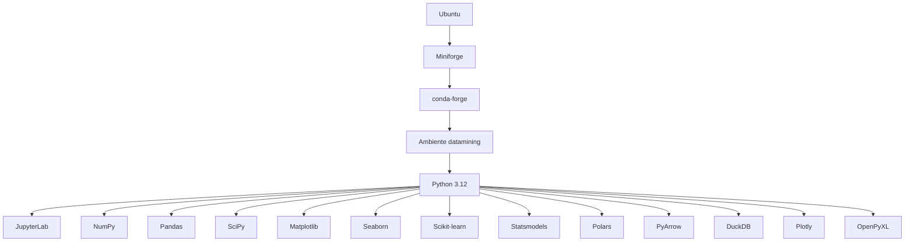

## AMBIENTE LIVRE DE MINERAÇÃO DE DADOS (Professor Feichas)

### Ubuntu Nativo e Ubuntu no WSL2

**Objetivo**
Este tutorial prepara um ambiente completo para programação Python, análise e mineração de dados.
A configuração será a mesma nos dois ambientes:


XlsxWriter


- A filosofia do ambiente é:
    - somente conda-forge
    - prioridade estrita de canais
    - nenhum pacote vindo de defaults
    - nenhum ambiente base ativado automaticamente
    - ambiente isolado para mineração de dados
    - configuração reproduzível através de environment.yml

### PARTE 1 — ESCOLHER O SEU AMBIENTE
Você pode usar este tutorial em:

- Opção A — Ubuntu nativo
Computador
└── Ubuntu
└── Miniforge
└── datamining

- Opção B — Windows + WSL2
Windows
└── WSL2
└── Ubuntu
└── Miniforge
└── datamining
Depois que o Ubuntu estiver funcionando, os procedimentos são praticamente iguais.

### PARTE 2 — UBUNTU NATIVO

#### 2.1 Atualizar o sistema

- Abra o Terminal:
```powershel
sudo apt update
```
- Depois:
```powershell
sudo apt upgrade -y
```
#### 2.2 Instalar ferramentas básicas

```powershell
sudo apt install -y wget curl bzip2 ca-certificates
```
- Verifique:
```powershell
wget --version
```
### PARTE 3 — WINDOWS + WSL2

#### 3.1 Instalar o WSL2
- Esta etapa é feita no Windows.
- Abra o PowerShell como administrador e execute:

```powershell
wsl --install
```
- Reinicie o Windows se for solicitado.
- Depois confira no Powershell ou CMD

```powershell
wsl --status
```
#### 3.2 Verificar as distribuições disponíveis

```powershell
wsl --list --online
```
- Instale o Ubuntu:
```powershell
wsl --install -d Ubuntu
```

#### 3.3 Entrar no Ubuntu

Depois da instalação, abra o Ubuntu pelo menu Iniciar. Na primeira execução, o Ubuntu solicitará:
- Enter new UNIX username:
- Escolha seu usuário.
- Depois defina uma senha.
- Essa senha é a senha do usuário Linux dentro do WSL.

#### 3.4 Atualizar o Ubuntu no WSL

- Dentro do Ubuntu:

```powershell
sudo apt update
```

- Depois:
```powershell
sudo apt upgrade -y
```

- Instale as ferramentas:
```powershell
sudo apt install -y wget curl bzip2 ca-certificates
```
- A partir deste ponto, o procedimento é o mesmo do Ubuntu nativo.

### PARTE 4 — INSTALAR O MINIFORGE

#### 4.1 Criar o diretório de downloads

```powershell
mkdir -p ~/Downloads
```
Entre nele:
```powershell
cd ~/Downloads
```

#### 4.2 Baixar o Miniforge

Para computadores Intel/AMD de 64 bits:
```powershell
wget -O Miniforge3.sh https://github.com/conda-forge/miniforge/releases/latest/download/Miniforge3-Linux-x86_64.sh
```
Confira:

```powershell
ls -lh Miniforge3.sh
```

#### 4.3 Instalar

- Execute:

```powershell
bash Miniforge3.sh
```
- Durante a instalação:
    - Licença
    - Quando aparecer: Do you accept the license terms? [yes|no]
        - responda: yes
    - Localização
    - Quando aparecer algo como:
        - [/home/usuario/miniforge3]
        - pressione:
            - Enter
        - Inicialização automática
            - Quando aparecer:
                - Do you wish to update your shell profile to automatically initialize conda?
                    - responda:
                        - no
        - Vamos configurar o shell manualmente.

### PARTE 5 — CONFIGURAR O BASH

#### 5.1 Remover o instalador

```powershell
rm ~/Downloads/Miniforge3.sh
```

#### 5.2 Editar o .bashrc

```powershell
nano ~/.bashrc
```

No final do arquivo, adicione:
# Miniforge
export PATH="$HOME/miniforge3/bin:$PATH"
source "$HOME/miniforge3/etc/profile.d/conda.sh"

- Salve:
    -Ctrl + O
    - Enter
    - Ctrl + X

-Recarregue:

```powershell
source ~/.bashrc
```

### PARTE 6 — TESTAR O CONDA

Execute:
```powershell
conda --version
```

Agora:
```powershell
type conda
```
O resultado deverá indicar que conda é uma função.
Por exemplo:
conda is a function
Isso é importante porque permite:
conda activate
e:
conda deactivate

### PARTE 7 — CONFIGURAR SOMENTE O CONDA-FORGE
Esta é uma etapa fundamental.
Primeiro:
```powershell
conda config --remove-key channels
```

Se aparecer uma mensagem informando que a chave não existe, pode continuar.

Adicione somente:
```powershell
conda config --add channels conda-forge
```

Configure prioridade estrita:
```powershell
conda config --set channel_priority strict
```

### PARTE 8 — NÃO ATIVAR O BASE AUTOMATICAMENTE

Execute:
```poweshell
conda config --set auto_activate false
```

Verifique:
```powershell
conda config --show auto_activate
```
Esperamos:
auto_activate: False
Agora feche o terminal.
Abra novamente.
O terminal deverá aparecer normalmente:
usuario@computador:~$
e NÃO:
(base) usuario@computador:~$
Esse é o comportamento desejado.

### PARTE 9 — CONFERIR OS CANAIS

Execute:
```powershell
conda config --show channels channel_priority
```

O resultado esperado:
channel_priority: strict
channels:
- conda-forge
A partir daqui, o ambiente será configurado para usar somente o conda-forge.

### PARTE 10 — CRIAR A ESTRUTURA DO AMBIENTE

Vamos manter os ambientes separados dos projetos.

Crie:
```powershell
mkdir -p ~/conda-envs/datamining
```

Entre no diretório:
```powershell
cd ~/conda-envs/datamining
```
Confira:
```powershell
pwd
```

Deverá aparecer algo semelhante a:
/home/usuario/conda-envs/datamining

### PARTE 11 — CRIAR O ENVIRONMENT.YML

Crie o arquivo:
nano environment.yml
Coloque:
name: datamining
channels:
- conda-forge
dependencies:
- python=3.12
- pip
Salve:
Ctrl + O
Enter
Ctrl + X

### PARTE 12 — CRIAR O AMBIENTE

Execute:
```powershell
conda env create -f environment.yml
```

No final deverá aparecer:
To activate this environment, use conda activate datamining

### PARTE 13 — ATIVAR O AMBIENTE

```powershell
conda activate datamining
```

O terminal deverá mudar para:
(datamining) usuario@computador:~$
Isso é correto.
O (datamining) indica que o ambiente está ativo.

### PARTE 14 — TESTAR O PYTHON

Execute:
```powershell
python --version
```

Esperamos:
Python 3.12.x

Agora:
```powershell
which python
```

Deverá apontar para algo semelhante a:
/home/usuario/miniforge3/envs/datamining/bin/python
Isso confirma que estamos usando o Python do ambiente.

### PARTE 15 — INSTALAR JUPYTER

Com o ambiente datamining ativo:
```powershell
conda install -y jupyterlab ipykernel
```

### PARTE 16 — INSTALAR ANÁLISE DE DADOS

```powershell
conda install -y numpy pandas matplotlib seaborn
```

### PARTE 17 — INSTALAR MINERAÇÃO DE DADOS E ESTATÍSTICA

```powershell
conda install -y scipy scikit-learn statsmodels
```

### PARTE 18 — INSTALAR FERRAMENTAS DE DADOS

```powershell
conda install -y polars pyarrow duckdb
```

### PARTE 19 — INSTALAR VISUALIZAÇÃO E EXCEL

```powershell
conda install -y plotly openpyxl xlsxwriter
```

### PARTE 20 — TESTAR TODAS AS BIBLIOTECAS

Execute:

```powershell
python -c "import numpy, pandas, scipy, sklearn, matplotlib, seaborn,
statsmodels, polars, pyarrow, duckdb, plotly; print('AMBIENTE OK')"
```

Se aparecer:
AMBIENTE OK
o ambiente está funcionando.

### PARTE 21 — CONFERIR OS CANAIS DOS PACOTES

Execute:
```powershell
conda list --show-channel-urls
```

Os pacotes Conda deverão estar associados ao:
conda-forge

Se aparecer algum canal inesperado, pare e verifique a configuração antes de
continuar.

### PARTE 22 — ATUALIZAR O ENVIRONMENT.YML

Depois que todos os pacotes estiverem instalados:
```powershell
conda env export --from-history > environment.yml
```

Confira:
cat environment.yml
Ele deverá conter uma lista semelhante a:
name: datamining
channels:
- conda-forge
dependencies:
- python=3.12
- pip
- jupyterlab
- ipykernel
- numpy
- pandas
- matplotlib
- seaborn
- scipy
- scikit-learn
- statsmodels
- polars
- pyarrow
- duckdb
- plotly
- openpyxl
- xlsxwriter

A ordem pode ser diferente.

### PARTE 23 — REGISTRAR O KERNEL DO JUPYTER

Com datamining ativo:
```powershell
python -m ipykernel install --user --name datamining --display-name "Python 3.12 - Mineração de Dados"
```

#### PARTE 24 — TESTAR O JUPYTERLAB

Execute:
jupyter lab
O JupyterLab deverá iniciar.
Para encerrá-lo:
Ctrl + C

### PARTE 25 — ORGANIZAÇÃO DOS PROJETOS

Não é necessário colocar os projetos dentro de ~/conda-envs.

Recomenda-se:

Crie o diretório:

```powershell
mkdir -p ~/workspace
```

### PARTE 26 — FLUXO DE TRABALHO
Ao abrir o terminal:
usuario@computador:~$
Nada é ativado automaticamente.
Para trabalhar:
```powershell
conda activate datamining
```
Agora:
(datamining) usuario@computador:~$
Entre no projeto:

```powershell
cd meu-projeto
```
Ao terminar:

```powershell
conda deactivate
```
O terminal volta para:
usuario@computador:~$

### PARTE 27 — COMANDOS IMPORTANTES

Listar ambientes
```powershell
conda env list
```

Ativar

```powershell
conda activate datamining
conda activate miniforge3/envs/datamining/
```

Desativar

```powershell
conda deactivate
```

Listar pacotes

```powershell
conda list
```

Mostrar canais

```powershell
conda config --show channels
```

Mostrar prioridade

```powershell
conda config --show channel_priority
```

Mostrar canais dos pacotes

```powershell
conda list --show-channel-urls
```

Atualizar ambiente

```powershell
conda env update -f environment.yml --prune
```

Remover ambiente

```powershell
conda env remove -n datamining
```

### PARTE 28 - RODAR O ORANGE

```powershell
python -m Orange.canvas
```

Eu rodei aqui:

```powershell
(datamining) salerno@salerno:~/miniforge3$ python -m Orange.canvas
```