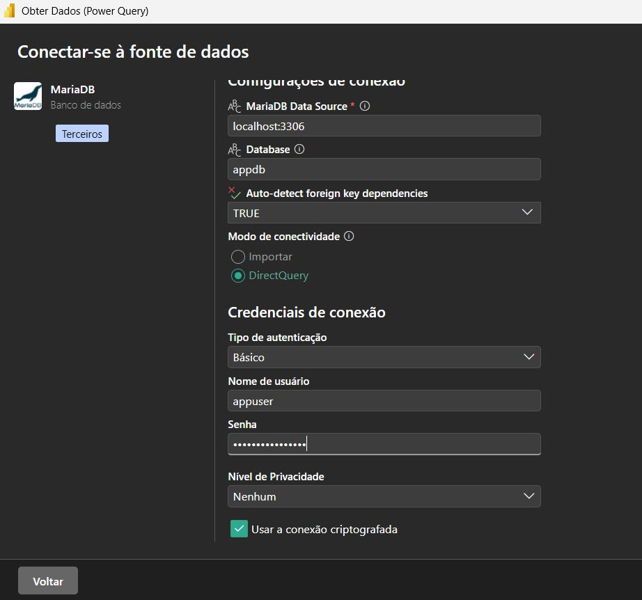
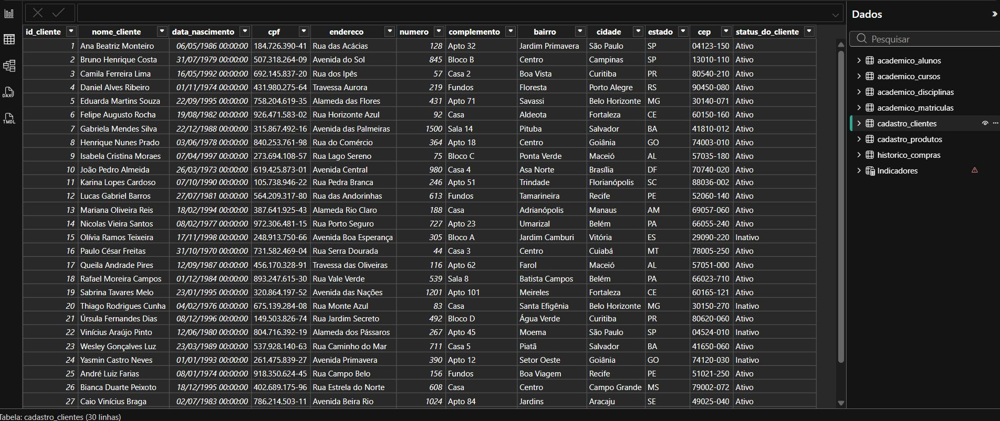
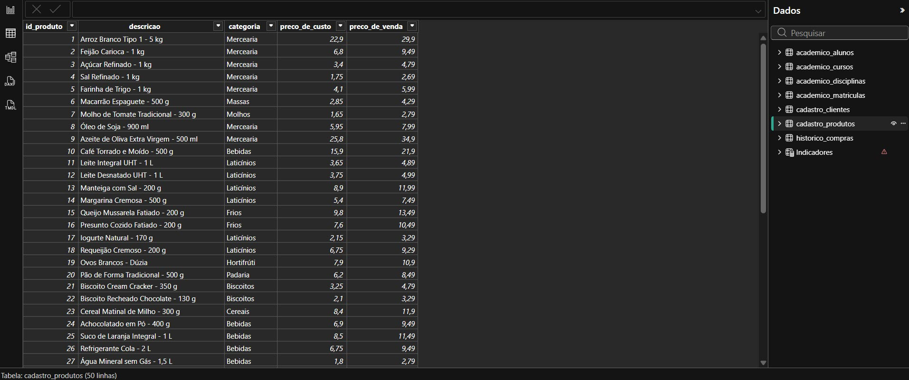
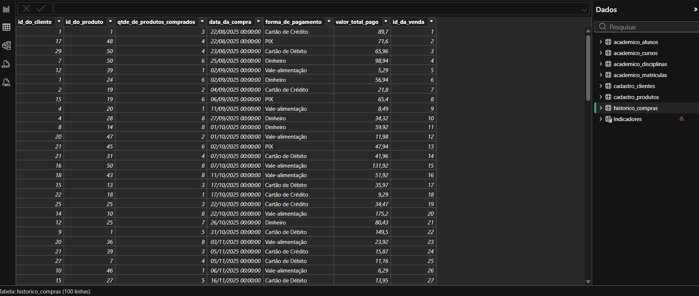
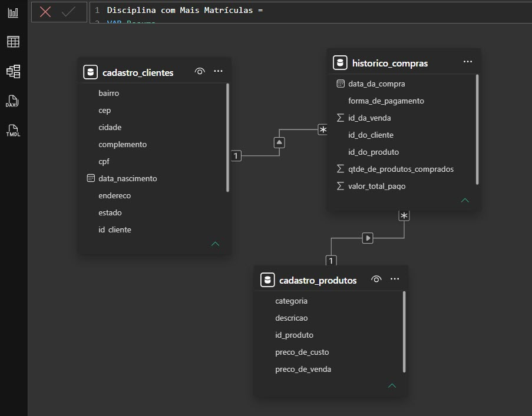
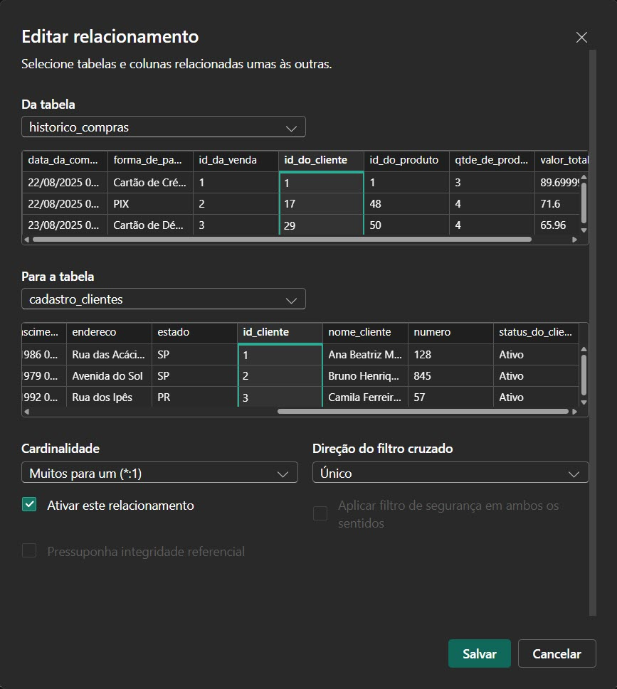
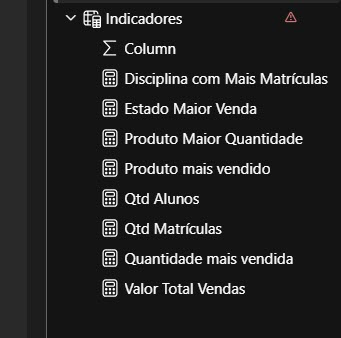
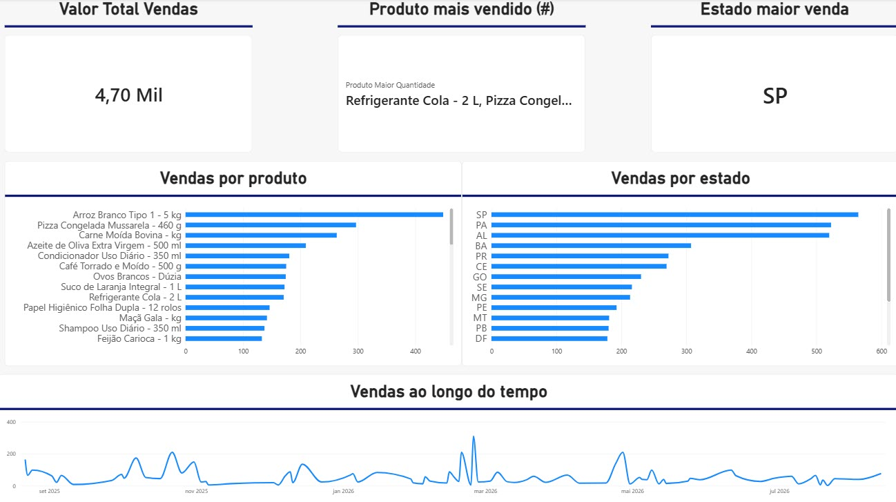

# Exercício 01 — Vendas

**Ferramentas:** Excel e Power BI

## Enunciado

Criar uma base de vendas com aproximadamente 30 registros, contendo as colunas:

- ID da venda;
- data;
- produto;
- categoria;
- quantidade;
- valor unitário;
- estado do cliente.

A base deve estar correta e completa, sem células vazias ou valores inválidos. Depois, importar a base para o Power BI e criar:

- um cartão com o valor total das vendas;
- um gráfico de vendas por produto;
- um gráfico de vendas por estado;
- um gráfico com a evolução das vendas ao longo do tempo.

Por fim, responder: **a)** qual produto vendeu mais; **b)** qual estado apresentou mais vendas; **c)** qual foi o valor total vendido.

## 1. Base de dados

A base utilizada é o arquivo [`data/exercicio_01.xlsx`](data/exercicio_01.xlsx), com três abas relacionadas por chave (`id_cliente` e `id_produto`):

| Aba | Registros | Conteúdo |
|---|---:|---|
| `cadastro-clientes` | 30 | dados cadastrais dos clientes, incluindo a coluna **Status do Cliente** (Ativo/Inativo) |
| `cadastro-produtos` | 50 | catálogo de produtos, com categoria e preços de custo/venda |
| `historico-compras` | 100 | vendas realizadas, ligando cliente e produto |

A visão de **vendas** pedida no enunciado é obtida unindo as três abas, o que produz exatamente as colunas solicitadas:

| Coluna do exercício | Origem |
|---|---|
| ID da venda | `historico-compras.ID da Venda` |
| data | `historico-compras.Data da Compra` |
| produto | `cadastro-produtos.Descrição` |
| categoria | `cadastro-produtos.Categoria` |
| quantidade | `historico-compras.Qtde de Produtos Comprados` |
| valor unitário | `cadastro-produtos.Preço de Venda` |
| estado do cliente | `cadastro-clientes.Estado` |

A base não possui células vazias ou valores inválidos: todos os `ID do Cliente` e `ID do Produto` do histórico têm correspondência nos cadastros, e as quantidades e valores são sempre maiores que zero.

## 2. Substituição dos dados no container MariaDB

O container `mariadb` já está configurado pelo [`docker-compose.yml`](../../../docker-compose.yml) (banco `appdb`, porta `3307`). Quando o arquivo [`data/exercicio_01.xlsx`](data/exercicio_01.xlsx) foi atualizado — passando a incluir a coluna **Status do Cliente** —, os dados antigos das três tabelas foram **substituídos** pelos novos, sem recriar o container, o volume ou as credenciais.

Antes de substituir, cada tabela foi salva com `mariadb-dump`, como backup de segurança:

```bash
docker exec mariadb mariadb-dump -uappuser -pSenhaAppForte123 appdb cadastro_clientes > cadastro_clientes_backup.sql
docker exec mariadb mariadb-dump -uappuser -pSenhaAppForte123 appdb cadastro_produtos > cadastro_produtos_backup.sql
docker exec mariadb mariadb-dump -uappuser -pSenhaAppForte123 appdb historico_compras > historico_compras_backup.sql
```

Em seguida, a substituição em si é feita com o script padrão do repositório, [`import_excel_mariadb.py`](../../../import_excel_mariadb.py), que lê cada aba do Excel, normaliza os nomes das colunas e grava no MariaDB com `if_exists="replace"` (apaga e recria cada tabela com o conteúdo novo):

```bash
cd exercicios/lista_01/exercicio_01
source ~/miniforge3/etc/profile.d/conda.sh
conda activate datamining
python ../../../import_excel_mariadb.py \
    --file data/exercicio_01.xlsx \
    --host 127.0.0.1 \
    --port 3307 \
    --database appdb \
    --user appuser \
    --if-exists replace \
    --skip-unnamed
```

Como o script deriva o nome das colunas automaticamente a partir do cabeçalho do Excel, a nova coluna **Status do Cliente** foi criada sem nenhuma alteração de schema manual, virando `status_do_cliente` na tabela `cadastro_clientes`.

Resultado da substituição:

| Aba do Excel | Tabela no MariaDB | Registros | Observação |
|---|---|---:|---|
| `cadastro-clientes` | `cadastro_clientes` | 30 | +coluna `status_do_cliente` |
| `cadastro-produtos` | `cadastro_produtos` | 50 | sem alteração de schema |
| `historico-compras` | `historico_compras` | 100 | sem alteração de schema |

Para conferir a carga:

```bash
docker exec mariadb mariadb -uappuser -pSenhaAppForte123 appdb -e \
    "SELECT status_do_cliente, COUNT(*) FROM cadastro_clientes GROUP BY status_do_cliente;"
```

## 3. Conexão do Power BI com o MariaDB

O Power BI se conecta ao MariaDB pelo conector nativo (**Obter Dados → MariaDB**), apontando para o mesmo banco `appdb` que recebeu a substituição na etapa anterior:



Parâmetros usados na conexão:

| Parâmetro | Valor |
|---|---|
| Servidor | `localhost:3307` (a partir do container/WSL) ou `127.0.0.1:3307` (a partir do Windows) |
| Banco de dados | `appdb` |
| Usuário | `appuser` |
| Senha | `SenhaAppForte123` |
| Modo de conectividade | DirectQuery |

Como a conexão é feita diretamente sobre as tabelas do banco, qualquer nova substituição de dados (como a realizada na seção 2) é refletida no Power BI ao atualizar a consulta, sem necessidade de reconfigurar a conexão.

## 4. Carga das tabelas no Power BI

Após a conexão, o Power Query carregou as três tabelas já com os dados substituídos. As capturas abaixo confirmam que a carga trouxe exatamente o que foi gravado no MariaDB na seção 2 — incluindo os identificadores como números inteiros sequenciais (`1`, `2`, `3`, ...) e a nova coluna `status_do_cliente`:



*`cadastro_clientes` (30 linhas): `id_cliente` aparece como inteiro (`1`, `2`, `3`...) e a coluna `status_do_cliente` (Ativo/Inativo) está presente — confirma que a substituição da seção 2 chegou corretamente ao Power BI.*



*`cadastro_produtos` (50 linhas): `id_produto`, `descricao`, `categoria`, `preco_de_custo` e `preco_de_venda`.*



*`historico_compras` (100 linhas): liga `id_do_cliente` e `id_do_produto` a cada `id_da_venda`, com `qtde_de_produtos_comprados`, `data_da_compra`, `forma_de_pagamento` e `valor_total_pago`.*

## 5. Modelo de relacionamentos

No modelo do Power BI, `historico_compras` é a tabela fato, relacionada a `cadastro_clientes` e `cadastro_produtos`:



- `cadastro_clientes (1) → (*) historico_compras` por `id_cliente` = `id_do_cliente`
- `cadastro_produtos (1) → (*) historico_compras` por `id_produto` = `id_do_produto`

O detalhe do relacionamento cliente ↔ histórico mostra a cardinalidade **muitos-para-um** com filtro cruzado em sentido único, e reforça que os valores de `id_cliente`/`id_do_cliente` usados na junção são os inteiros (`1`, `2`, `3`...) definidos na substituição da seção 2:



## 6. Medidas e painel

Sobre esse modelo foram criadas as medidas DAX usadas nos cartões e gráficos do painel (tabela `Indicadores`):



- `Valor Total Vendas` — soma de `valor_total_pago`;
- `Estado Maior Venda` — estado com maior soma de vendas;
- `Produto Maior Quantidade` / `Produto mais vendido` — produto(s) com maior quantidade vendida;
- `Quantidade mais vendida` — maior quantidade vendida de um único produto.

Com essas medidas, o painel final reúne o cartão de valor total, os dois gráficos de barras (produto e estado) e o gráfico de linha de evolução no tempo, pedidos no enunciado:



## 7. Respostas

### a) Qual produto vendeu mais?

Depende do critério, e o painel mostra os dois:

- **Em valor vendido** (gráfico "Vendas por produto"): **Arroz Branco Tipo 1 - 5 kg** é o produto com a maior barra, somando **R$ 448,50** em 15 unidades.
- **Em quantidade** (cartão "Produto mais vendido (#)"): empate entre **Refrigerante Cola - 2 L** e **Pizza Congelada Mussarela - 460 g**, ambos com 18 unidades vendidas — exatamente o que o cartão do painel exibe.

### b) Qual estado apresentou mais vendas?

**São Paulo (SP)**, como mostram tanto o cartão "Estado maior venda" quanto a barra mais alta do gráfico "Vendas por estado": **R$ 564,53** em vendas (11 vendas), seguido por Pará (PA, R$ 522,60) e Alagoas (AL, R$ 519,78).

### c) Qual foi o valor total vendido?

**R$ 4.700,59** (exibido como "4,70 Mil" no cartão "Valor Total Vendas" do painel), somando as 100 vendas registradas em `historico_compras`, no período de 22/08/2025 a 12/08/2026 — período visível no gráfico "Vendas ao longo do tempo".
