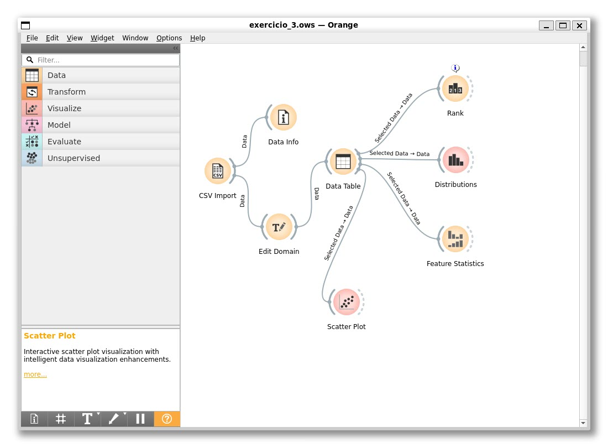
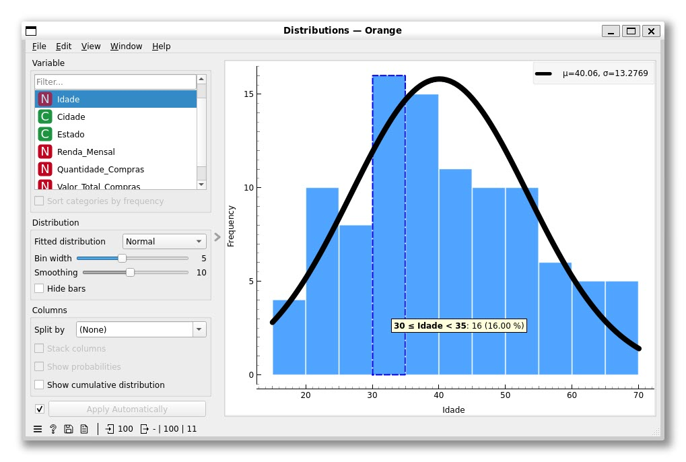
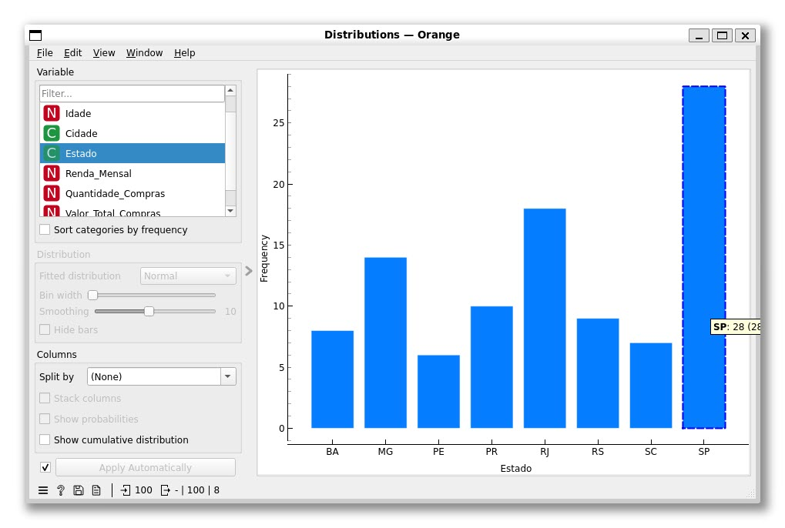
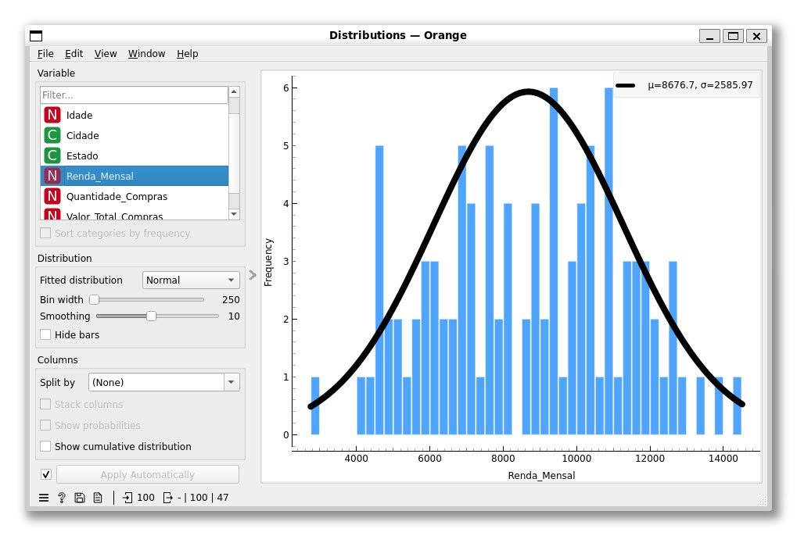
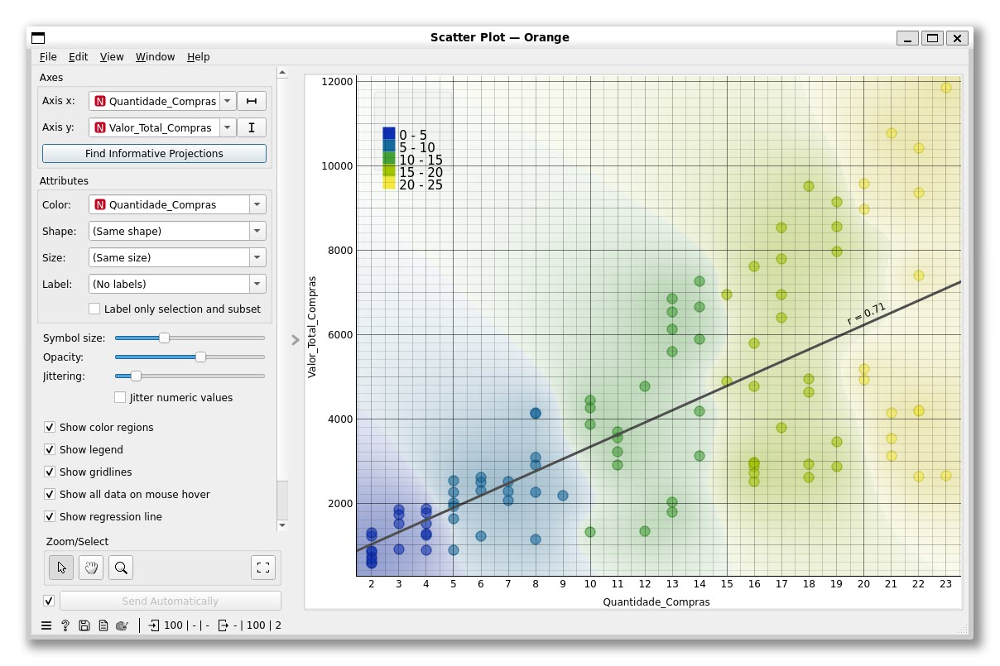

# Exercício 03 — Lista 01

Análise exploratória da base de clientes utilizando o Orange Data Mining
(fluxo em [`project/exercicio_3.ows`](../exercicio_03/project/exercicio_3.ows), dados em
[`data/exercicio_3_orange_data_mining.csv`](../exercicio_03/data/exercicio_3_orange_data_mining.csv)).

Fluxo utilizado (widgets `CSV Import` → `Edit Domain` → `Data Table` → `Distributions` / `Scatter Plot` / `Feature Statistics` / `Rank`):

## Respostas

### a) Qual faixa etária possui mais clientes?

A distribuição de `Idade` tem média $\mu = 40{,}06$ anos e desvio padrão $\sigma = 13{,}28$.
A faixa etária **30 ⊢ 35 anos** é a que concentra o maior número de clientes, com **16 clientes (16%)** do total.

### b) Qual estado possui mais clientes?

O estado de **São Paulo (SP)** possui o maior número de clientes, com **28 clientes**, bem à frente do segundo colocado (RJ, com 18 clientes).

### c) Qual é a distribuição da renda?

A variável `Renda_Mensal` apresenta uma distribuição aproximadamente **normal (em formato de sino)**, com média $\mu = 8676{,}70$ e desvio padrão $\sigma = 2585{,}97$. Os valores variam de cerca de R$ 3.000 a R$ 14.500, concentrando-se majoritariamente entre R$ 6.000 e R$ 11.000.

### d) Existe alguma relação entre quantidade de compras e valor total das compras?

Sim. O gráfico de dispersão entre `Quantidade_Compras` e `Valor_Total_Compras` mostra uma **correlação positiva forte** ($r = 0{,}71$), evidenciada pela reta de regressão ascendente: quanto maior a quantidade de compras realizadas por um cliente, maior tende a ser o valor total gasto.
