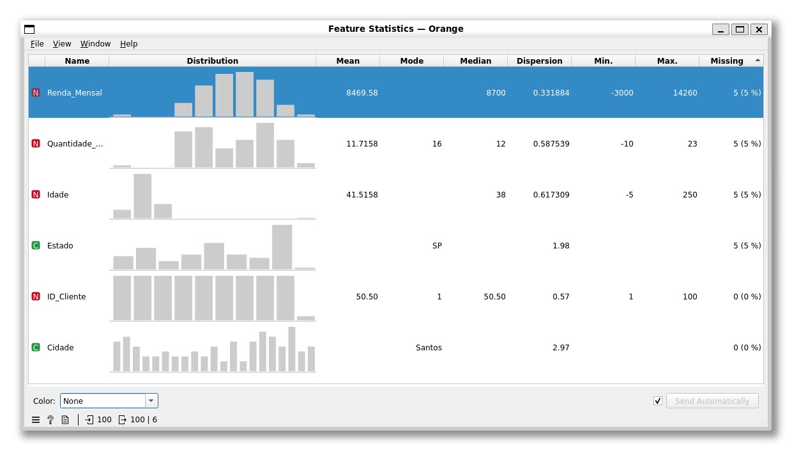
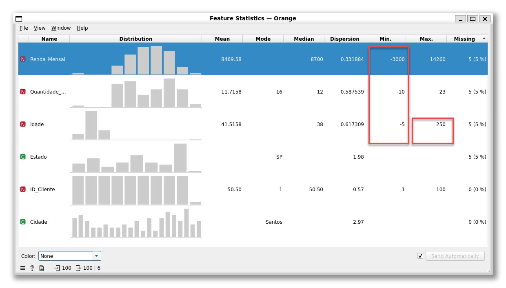
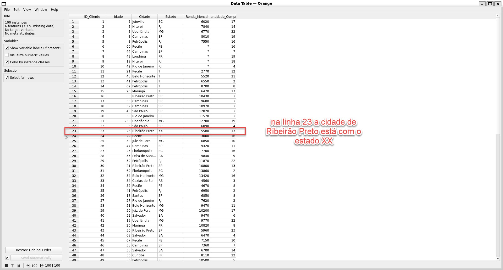

# Exercício 04 — Lista 01

Análise de qualidade dos dados (valores vazios e valores inválidos) utilizando o Orange Data Mining
(fluxo em [`project/exercicio_04.ows`](../exercicio_04/project/exercicio_04.ows), dados em
[`data/exercicio_4_orange_data_mining.csv`](../exercicio_04/data/exercicio_4_orange_data_mining.csv)).

## Respostas

### a) Quantos dados vazios foram encontrados?

A base possui **100 instâncias e 6 atributos**, com **3,3% de dados vazios (missing)** no total. Pelo widget `Feature Statistics`, os valores ausentes (`?`) estão concentrados em 4 colunas, cada uma com **5 valores vazios (5%)**:

| Atributo | Vazios |
|---|---|
| `Renda_Mensal` | 5 (5%) |
| `Quantidade_Compras` | 5 (5%) |
| `Idade` | 5 (5%) |
| `Estado` | 5 (5%) |
| `ID_Cliente` | 0 (0%) |
| `Cidade` | 0 (0%) |

### b) Quais valores eram inválidos?

Analisando os valores mínimos e máximos de cada atributo numérico, foram encontrados valores fora do domínio esperado (inválidos), mesmo sem estarem vazios:

- **`Renda_Mensal`**: valor mínimo de **-3000** (renda negativa não faz sentido).
- **`Idade`**: valor mínimo de **-5** e valor máximo de **250** (idades impossíveis).
- **`Quantidade_Compras`**: valor mínimo de **-10** (quantidade de compras não pode ser negativa).

Além disso, na tabela de dados (`Data Table`), a linha 23 apresenta o valor **"XX"** no atributo `Estado` — um código de UF que não existe no Brasil, sendo, portanto, um valor inválido.

### c) Qual é a diferença entre um dado vazio e um dado inválido?

- **Dado vazio (missing value)**: é a **ausência de informação** — o campo não foi preenchido e aparece representado como `?` (ou célula em branco). O sistema sabe que não há valor registrado naquele campo.
- **Dado inválido**: é um valor que **foi preenchido**, porém **não respeita as regras/domínio esperado** para aquele atributo — por exemplo, uma idade negativa (-5), uma idade de 250 anos, uma renda mensal negativa (-3000) ou uma sigla de estado que não existe ("XX"). O sistema não identifica automaticamente esse valor como um erro, pois tecnicamente existe um dado ali; é preciso uma análise de consistência (min/max, domínio de categorias) para detectá-lo.

Em resumo: o dado vazio é a **falta** de valor, enquanto o dado inválido é um valor **presente, mas incorreto/inconsistente** com o significado real do atributo.
