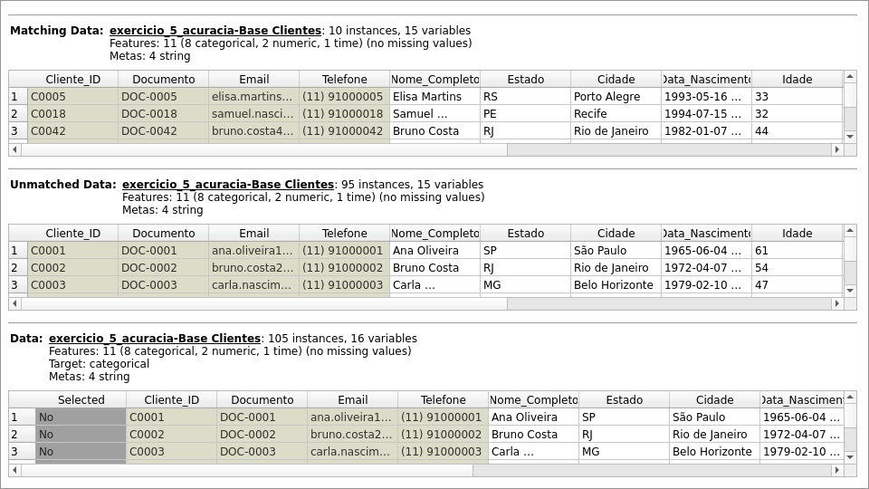

# Exercício 05 — Lista 01

Análise de qualidade de dados (validade, duplicidade, consistência e acurácia) utilizando o Orange Data Mining,
com base na planilha [`data/exercicio_5_acuracia.xlsx`](../exercicio_05/data/exercicio_5_acuracia.xlsx) (abas `Base Clientes`, `Fonte Referência` e `Respostas`).

## Roteiro no Orange

1. Exporte a planilha `Base Clientes` como CSV UTF-8 ou abra o arquivo Excel pelo widget `File`.
2. Use `Data Table` e `Feature Statistics` para revisar tipos, distribuições e valores incomuns.
3. Filtre `Flag_Duplicidade = Duplicado` e compare `Cliente_ID` e `Documento`.
4. Filtre `Flag_Acuracia = Divergente` e confronte o `Estado` com a `Fonte Referência`.
5. Filtre `Flag_Consistencia = Inconsistente` e compare `Idade` com `Data_Nascimento`.

## Respostas

### a) Um valor pode ser válido e ainda assim estar errado? Dê um exemplo.

Sim. Um valor pode respeitar o formato e o domínio esperado (portanto ser **válido**) e, mesmo assim, não corresponder à realidade (ser **impreciso/errado**). Exemplo na base: o cliente `C0052 — Lucas Costa` está registrado com `Estado = "RJ"` na `Base Clientes`, o que é um valor válido (sigla de UF existente). Porém, ao comparar com a aba `Fonte Referência`, o estado correto para esse cliente seria outro segundo a fonte oficial — ou seja, "RJ" é um valor **válido**, mas **errado**, pois não reflete o dado real do cliente.

### b) O que é uma duplicidade?

Duplicidade é a **repetição indevida do mesmo registro (ou da mesma entidade) na base de dados**. Pode ser uma cópia exata do registro ou uma repetição com pequenas diferenças em campos secundários (por exemplo, mesmo `Cliente_ID` e `Documento`, mas com pequenas variações de digitação em outros campos).

Na base analisada, a coluna `Flag_Duplicidade = Duplicado` identifica **10 registros duplicados** entre as 105 linhas da planilha (clientes como `C0005`, `C0018`, `C0042`, `C0071` e `C0095` aparecem repetidos com o mesmo `Cliente_ID` e `Documento`).

### c) O que significa dizer que dois dados são inconsistentes?

Significa que os valores **não podem ser verdadeiros ao mesmo tempo**, segundo uma regra lógica ou de negócio. Exemplo na base: o campo `Flag_Consistencia = Inconsistente` aparece em registros como `C0077 — Renata Costa`, que tem `Idade = 12` e `Data_Nascimento = 2002-01-12`. Considerando a data de corte (2026), essa pessoa deveria ter 24 anos, não 12 — os dois campos (`Idade` e `Data_Nascimento`) são logicamente incompatíveis entre si, caracterizando uma inconsistência.

### d) Explique, com suas palavras, a diferença entre validade e acurácia

- **Validade** verifica se o dado respeita o **formato, tipo, faixa (min/máx) ou domínio permitido** para aquele atributo — por exemplo, se `Estado` contém uma sigla de UF que realmente existe (SP, RJ, MG etc.), independentemente de ser a sigla correta para aquele cliente específico.
- **Acurácia** verifica se o dado **corresponde ao fato real ou a uma fonte confiável** — ou seja, além de ter um formato válido, o valor precisa representar a verdade sobre a entidade descrita. Um dado pode ser válido (formato correto) e ainda assim ser impreciso/inacurado (não bater com a fonte de referência), como no exemplo da pergunta (a).

Em resumo: **validade** avalia a forma do dado (é um valor permitido?), enquanto **acurácia** avalia o conteúdo do dado (é o valor verdadeiro?).
